<h1 align="center">OpenSWI: A Massive-Scale Benchmark Dataset for Surface Wave Dispersion Curve Inversion</h1>

<p align="center">
    🌐 <a href="" target="_blank">Project</a> | 
    📃 <a href="" target="_blank">Paper</a> | 
    🤗 <a href="https://huggingface.co/datasets/LiuFeng2317/OpenSWI" target="_blank">Dataset</a> <br>
</p>

<div align="center">
  
  
</div>
<div align="center">
  
  
  
  
</div>

---


> **OpenSWI: A Massive-Scale Benchmark Dataset for Surface Wave Dispersion Curve Inversion**
> 
> [**Feng Liu**](https://liufeng2317.github.io/), Sijie Zhao, Xinyu Gu, Fenghua Lin, Yaxing Li*, Rui Su*, Jianping Huang, Lei Bai
> 
> **Abstract:** Surface wave dispersion curve inversion is fundamental to shallow resource exploration and deep geological evolution studies, yet it remains challenged by low computational efficiency, sensitivity to initial models, and susceptibility to local minima. Data-driven deep learning methods, inspired by their success in computer vision and other fields, show great potential for enabling efficient and accurate inversion. However, the lack of large-scale and diverse benchmark datasets for surface wave dispersion curves continues to limit the development and evaluation of such methods in seismic imaging. To address this gap, we first present SWIDP, a complete and efficient dataset construction pipeline that automates the entire workflow from geological model generation to dispersion curve synthesis. Using SWIDP, we built two large-scale benchmark datasets: (1) **OpenSWI-shallow**, based on 2-D geological models from the OpenFWI dataset, which covers a wide range of near-surface geological features (**Flat, Flat-Fault, Fold, Fold-Fault, and Field**) and contains over **22 million** 1-D velocity profiles paired with fundamental-mode group and phase velocity dispersion curves; and (2) **OpenSWI-deep**, derived from the integration of **14 global and regional 3-D geological models**, which comprises approximately **1.26 million** pairs of high-fidelity synthetic data. Additionally, we curated and released **OpenSWI-real**, an AI-ready dataset containing observed dispersion curves and corresponding 1-D reference velocity models, providing a robust basis for evaluating real-world model performance. Experimental results show that Transformer-based models trained on the synthetic OpenSWI datasets yield inversion results on observed data that closely match reference models, demonstrating the datasets’ diversity and representativeness. To promote advances in intelligent surface wave dispersion curve inversion, we openly release the SWIDP toolbox, the complete OpenSWI datasets, pre-trained deep learning models, and all associated codes, providing comprehensive resources for the research community.

----

## 📊 [Datasets](https://huggingface.co/datasets/LiuFeng2317/OpenSWI)
**More Details of the OpenSWI Datasets can be found at huggingface** ([OpenSWI Huggingface](https://huggingface.co/datasets/LiuFeng2317/OpenSWI))
* [**OpenSWI-Shallow**](https://huggingface.co/datasets/LiuFeng2317/OpenSWI/tree/main/Datasets/OpenSWI-shallow/0.2-10s-Aug): 1D velocity profiles derived from 2D velocity models (OpenFWI dataset), paired with corresponding surface wave dispersion curves.
* [**OpenSWI-Deep**](https://huggingface.co/datasets/LiuFeng2317/OpenSWI/tree/main/Datasets/OpenSWI-deep/1s-100s-Aug): 1D velocity profiles generated from high-resolution 3D geological models, sourced globally and regionally, tailored for deep geological studies.
* [**OpenSWI-Real**](https://huggingface.co/datasets/LiuFeng2317/OpenSWI/tree/main/Datasets/OpenSWI-real): AI-ready observational data from Long Beach, USA, and the China Seismological Reference Model Project, with 1D velocity profiles and corresponding surface wave dispersion curves.

<table>
<thead>
<tr>
  <th>Group</th>
  <th>Datasets</th>
  <th>Period Range (s)</th>
  <th>Depth Range and Interval (km)</th>
  <th>Extracted 1D Velocity</th>
  <th>Augmented 1D Velocity</th>
</tr>
</thead>
<tbody>

<tr>
  <td rowspan="5"><a href="https://huggingface.co/datasets/LiuFeng2317/OpenSWI/tree/main/Datasets/OpenSWI-shallow/0.2-10s-Aug">OpenSWI-shallow</a></td>
  <td>OpenFWI-FlatVelA</td>
  <td>0.1-10 s</td>
  <td>0-2.8 km / 0.04 km</td>
  <td>30,000 x 4 x 70</td>
  <td>1,490,415 x 4 x 70</td>
</tr>
<tr>
  <td>OpenFWI-Flat-FaultA</td>
  <td>0.1-10 s</td>
  <td>0-2.8 km / 0.04 km</td>
  <td>292,941 x 4 x 70</td>
  <td>2,925,151 x 4 x 70</td>
</tr>
<tr>
  <td>OpenFWI-CurveVel</td>
  <td>0.1-10 s</td>
  <td>0-2.8 km / 0.04 km</td>
  <td>295,773 x 4 x 70</td>
  <td>2,952,975 x 4 x 70</td>
</tr>
<tr>
  <td>OpenFWI-Fold-Fault</td>
  <td>0.1-10 s</td>
  <td>0-2.8 km / 0.04 km</td>
  <td>537,774 x 4 x 70</td>
  <td>5,369,692 x 4 x 70</td>
</tr>
<tr>
  <td>OpenFWI-StyleA</td>
  <td>0.1-10 s</td>
  <td>0-2.8 km / 0.04 km</td>
  <td>2,344,958 x 4 x 70</td>
  <td>9,345,103 x 4 x 70</td>
</tr>

<tr>
  <td rowspan="14"><a href="https://huggingface.co/datasets/LiuFeng2317/OpenSWI/tree/main/Datasets/OpenSWI-deep/1s-100s-Aug">OpenSWI-deep</a></td>
  <td>LITHO1.0</td>
  <td>1-100 s</td>
  <td>0-300 km / 1.0 km</td>
  <td>40,959 x 4 x 300</td>
  <td>245,771 x 4 x 70</td>
</tr>
<tr>
  <td>USTClitho1.0</td>
  <td>1-100 s</td>
  <td>0-300 km / 1.0 km</td>
  <td>9,125 x 4 x 300</td>
  <td>54,750 x 4 x 70</td>
</tr>
<tr>
  <td>Central-and-Western US</td>
  <td>1-100 s</td>
  <td>0-300 km / 1.0 km</td>
  <td>6,803 x 4 x 300</td>
  <td>40,818 x 4 x 70</td>
</tr>
<tr>
  <td>Continental China</td>
  <td>1-100 s</td>
  <td>0-300 km / 1.0 km</td>
  <td>4,516 x 4 x 300</td>
  <td>27,096 x 4 x 70</td>
</tr>
<tr>
  <td>US Upper-Mantle</td>
  <td>1-100 s</td>
  <td>0-300 km / 1.0 km</td>
  <td>3,678 x 4 x 300</td>
  <td>22,061 x 4 x 70</td>
</tr>
<tr>
  <td>EUcrust</td>
  <td>1-100 s</td>
  <td>0-300 km / 1.0 km</td>
  <td>43,520 x 4 x 300</td>
  <td>261,155 x 4 x 70</td>
</tr>
<tr>
  <td>Alaska</td>
  <td>1-100 s</td>
  <td>0-300 km / 1.0 km</td>
  <td>19,408 x 4 x 300</td>
  <td>116,448 x 4 x 70</td>
</tr>
<tr>
  <td>CSEM-Europe</td>
  <td>1-100 s</td>
  <td>0-300 km / 1.0 km</td>
  <td>21,931 x 4 x 300</td>
  <td>131,586 x 4 x 70</td>
</tr>
<tr>
  <td>CSEM-Eastmed</td>
  <td>1-100 s</td>
  <td>0-300 km / 1.0 km</td>
  <td>12,782 x 4 x 300</td>
  <td>76,692 x 4 x 70</td>
</tr>
<tr>
  <td>CSEM-Iberian</td>
  <td>1-100 s</td>
  <td>0-300 km / 1.0 km</td>
  <td>9,102 x 4 x 300</td>
  <td>54,612 x 4 x 70</td>
</tr>
<tr>
  <td>CSEM-South Atlantic</td>
  <td>1-100 s</td>
  <td>0-300 km / 1.0 km</td>
  <td>7,371 x 4 x 300</td>
  <td>44,226 x 4 x 70</td>
</tr>
<tr>
  <td>CSEM-North Atlantic</td>
  <td>1-100 s</td>
  <td>0-300 km / 1.0 km</td>
  <td>14,541 x 4 x 300</td>
  <td>87,246 x 4 x 70</td>
</tr>
<tr>
  <td>CSEM-Japan</td>
  <td>1-100 s</td>
  <td>0-300 km / 1.0 km</td>
  <td>14,641 x 4 x 300</td>
  <td>87,846 x 4 x 70</td>
</tr>
<tr>
  <td>CSEM-Astralasia</td>
  <td>1-100 s</td>
  <td>0-300 km / 1.0 km</td>
  <td>4,131 x 4 x 300</td>
  <td>24,786 x 4 x 70</td>
</tr>

<tr>
  <td rowspan="2"><a href="https://huggingface.co/datasets/LiuFeng2317/OpenSWI/tree/main/Datasets/OpenSWI-real/">OpenSWI-real</a></td>
  <td><a href="https://huggingface.co/datasets/LiuFeng2317/OpenSWI/tree/main/Datasets/OpenSWI-real/LongBeach">LongBeach</a></td>
  <td>0.263 - 1.666 s</td>
  <td>0-1.4 km / 0.04 km</td>
  <td>5,297 x 4 x 35</td>
  <td>-</td>
</tr>
<tr>
  <td><a href="https://huggingface.co/datasets/LiuFeng2317/OpenSWI/tree/main/Datasets/OpenSWI-real/CSRM">CSRM</a></td>
  <td>8 - 70 s</td>
  <td>0-120 km / 1.0 km</td>
  <td>12,901 x 4 x 120</td>
  <td>-</td>
</tr>

</tbody>
</table>

----

## 🔄 [SWIDP: Integrated Workflow for Dataset Construction](./Datasets/OpenSWI/SWIDP/)  

SWIDP provides a fully modular pipeline for constructing large-scale surface-wave dispersion curve datasets:  

1. **Collect and standardize geological models**  
   Aggregate 2D/3D geological–geomorphological models from public databases and literature, and unify data format through cleaning, parameter conversion, and normalization.  

2. **Build 1D velocity models**  
   Extract representative 1D shear-wave velocity profiles, de-duplicate, optimize thin layers, interpolate to uniform thickness, and complete missing parameters (e.g., \(v_p\), density).  

3. **Augment for geological diversity**  
   Apply perturbation-based and generative-model-based enhancements to improve geological diversity and boundary complexity coverage.  

4. **Forward modeling of dispersion curves**  
   Efficiently compute large-scale surface-wave dispersion curves (using an optimized **Disba**-based solver with parallelization) across diverse period ranges.  


---

### 📚 Example 1: Building the **OpenSWI-shallow** Dataset

```python
import numpy as np
import sys
sys.path.append("OpenSWI/Datasets/OpenSWI/")
from SWIDP.process_1d_shallow import augment_workflow
from SWIDP.dispersion import (
    generate_mixed_samples, calculate_dispersion,
    transform_vp_to_vs, transform_vs_to_vel_model
)
from p_tqdm import p_map

# Step 1: Load 1D velocity model n x (depth, vp)
depth_vp = np.loadtxt(
    "./OpenSWI/Datasets/OpenSWI/Datasets-Construction/OpenSWI-shallow/0.2-10s-Aug/vp_demo.txt"
)
depth = depth_vp[:, 0]
vp = depth_vp[:, 1]

# Step 2: Convert vp to vs
vs = transform_vp_to_vs(vp)

# Step 3: Augment vs models
augment_nums = 100
vs_augmented = augment_workflow(
    vs, depth,
    perturb_num=augment_nums,
    vs_perturbation=0.05,           # relative ratio
    thickness_perturbation=0.1,     # relative ratio
    vel_threshold=0.05,             # km/s
    thickness_threshold=0.01,       # km
    min_layers_num=3,
    smooth_vel=False,
    smooth_nodes=10
)

# Step 4: Build full velocity models (depth, vp, vs, rho)
vel_model_augmented = p_map(
    transform_vs_to_vel_model,
    list(vs_augmented),
    [depth] * len(vs_augmented)
)

# Step 5: Generate dispersion curves [t, phase velocity, group velocity]
t = generate_mixed_samples(
    num_samples=100, start=0.2, end=10,
    uniform_num=50, log_num=20, random_num=30
)
disp = p_map(
    calculate_dispersion,
    vel_model_augmented,
    [t] * len(vel_model_augmented)
)
```

Details of this example can be found at

| Dataset Type    | Description                         | Link                                                                                      |
|-----------------|-------------------------------------|-------------------------------------------------------------------------------------------|
| **OpenSWI-shallow Example** | Example notebook for the OpenSWI dataset | [OpenSWI-shallow-example.ipynb](./Datasets/Datasets-Construction/OpenSWI-shallow/0.2-10s-Aug/00_OpenSWI-shallow-example.ipynb) |
| **Flat**        | Flat velocity model construction    | [OpenFWI-FlatVel-A.ipynb](./Datasets/Datasets-Construction/OpenSWI-shallow/0.2-10s-Aug/01_1_OpenFWI-FlatVel-A.ipynb) |
| **Flat-Fault**  | Flat velocity model with fault      | [OpenFWI-FlatFault-A.ipynb](./Datasets/Datasets-Construction/OpenSWI-shallow/0.2-10s-Aug/01_2_OpenFWI-FlatFault-A.ipynb) |
| **Fold**        | Fold velocity model construction    | [OpenFWI-CurveVel-A.ipynb](./Datasets/Datasets-Construction/OpenSWI-shallow/0.2-10s-Aug/01_3_OpenFWI-CurveVel-A.ipynb) |
| **Fold-Fault**  | Fold velocity model with fault      | [OpenFWI-CurveFault-A.ipynb](./Datasets/Datasets-Construction/OpenSWI-shallow/0.2-10s-Aug/01_4_OpenFWI-CurveFault-A.ipynb) |
| **Field**       | Field data modeling                 | [OpenFWI-Style-A.ipynb](./Datasets/Datasets-Construction/OpenSWI-shallow/0.2-10s-Aug/01_5_OpenFWI-Style-A.ipynb) |


---

### 📚 Example 2: Building the **OpenSWI-deep** Dataset

```python
import numpy as np
import sys
sys.path.append("../../../")
from SWIDP.process_1d_deep import *
from SWIDP.dispersion import generate_mixed_samples,calculate_dispersion,transform_vs_to_vel_model
from p_tqdm import p_map

# step1: get 1d velocity model (vp model or vs)
depth_vs = np.loadtxt("./Datasets/Datasets-Construction/OpenSWI-deep/1s-100s-Aug/vs_demo.txt")
depth = depth_vs[:,0]
vs = depth_vs[:,1]

# step2-1: remove the thin sandwidth layer
vs = combine_thin_sandwich(vs,
                            depth,
                            thickness_threshold=12, # km
                            uniform_thickness=1,    # km (thickness_threshold/uniform_thickness) = max_check_layers
                            gradient_threshold=0.05, # km/s (gradient_threshold)
                            return_idx=False
                            )

# step2-2: smooth the vs model (selectable)
vs = smooth_vs_by_node_interp(vs,
                            depth,
                            n_nodes=20,
                            method="pchip"
                            )

# step3: find moho index
moho_idx = find_moho_depth(vs,
                           depth,
                           [5,90], # range of moho index
                           gradient_search=False,
                           gradient_threshold=0.01)

# step4: augment the vs model
perturb_nums = 100
vs_augmented = p_map(augment_crust_moho_mantle,
                    [vs]*perturb_nums,
                    list(depth.reshape(1,-1))*perturb_nums,
                    [moho_idx]*perturb_nums,
                    [[-0.1,0.1]]*perturb_nums, # relative ratio
                    [[3,8]]*perturb_nums,     # nodes for crust
                    [[8,15]]*perturb_nums,   # nodes for mantle
                    [3]*perturb_nums,          # km 
                    [2]*perturb_nums,     # km
                    [False]*perturb_nums,
                    np.random.randint(0,1000000,perturb_nums)
                    )

# step5: transform the vs model to vp model
vel_models = p_map(transform_vs_to_vel_model,list(vs_augmented),[depth]*len(vs_augmented))

# step6: calculate the dispersion curve
t = generate_mixed_samples(num_samples=300,start=1,end=100,uniform_num=100,log_num=100,random_num=100)
t = np.ones((len(vel_models),len(t)))*t
disp_data = p_map(calculate_dispersion, vel_models, list(t))
disp_data = np.array(disp_data)
vel_models = np.array(vel_models)

```

Details of this example can be found at:

| Dataset Name               | Reference                                                                                   | Link                                                                                       |
|----------------------------|---------------------------------------------------------------------------------------------|--------------------------------------------------------------------------------------------|
| OpenSWI-deep-example        | -                                                                                           | [OpenSWI-deep-example.ipynb](./Datasets/Datasets-Construction/OpenSWI-deep/1s-100s-Aug/00_OpenSWI-deep-example.ipynb) |
| LITHO1.0                   | Pasyanos et al., 2014                                                                        | [LITHO1.0](./Datasets/Datasets-Construction/OpenSWI-deep/1s-100s-Aug/12_LITHO1.ipynb) |
| USTClitho1.0               | Xin et al., 2018                                                                             | [USTClitho1.0](./Datasets/Datasets-Construction/OpenSWI-deep/1s-100s-Aug/11_USTCLitho1.ipynb) |
| Central-and-Western US     | Shen et al., 2013                                                                            | [Central-and-Western US](./Datasets/Datasets-Construction/OpenSWI-deep/1s-100s-Aug/13_Central_and_Western_US_Shen2013.ipynb) |
| Continental China          | Shen et al., 2016                                                                            | [Continental China](./Datasets/Datasets-Construction/OpenSWI-deep/1s-100s-Aug/14_Continental_China_Shen2016.ipynb) |
| US Upper-Mantle            | Xie et al., 2018                                                                              | [US Upper-Mantle](./Datasets/Datasets-Construction/OpenSWI-deep/1s-100s-Aug/03_US-upper-mantle.ipynb) |
| EUCrust                    | Lu et al., 2018                                                                               | [EUCrust](./Datasets/Datasets-Construction/OpenSWI-deep/1s-100s-Aug/05_EUCrust.ipynb) |
| Alaska                     | Berg et al., 2020                                                                             | [Alaska](./Datasets/Datasets-Construction/OpenSWI-deep/1s-100s-Aug/04_Alaska.ipynb) |
| CSEM-Europe                | Blom et al., 2020; Fichtner et al., 2018; Çubuk-Sabuncu et al., 2017                         | [CSEM-Europe](./Datasets/Datasets-Construction/OpenSWI-deep/1s-100s-Aug/02_CSEM_Europe.ipynb) |
| CSEM-Eastmed               | Blom et al., 2020; Fichtner et al., 2018                                                     | [CSEM-Eastmed](./Datasets/Datasets-Construction/OpenSWI-deep/1s-100s-Aug/01_CSEM_Eastmed.ipynb) |
| CSEM-Iberian               | Fichtner et al., 2018; Fichtner et al., 2015                                                 | [CSEM-Iberian](./Datasets/Datasets-Construction/OpenSWI-deep/1s-100s-Aug/09_CSEM_lberia.ipynb) |
| CSEM-South Atlantic        | Fichtner et al., 2018; Colli et al., 2013                                                   | [CSEM-South Atlantic](./Datasets/Datasets-Construction/OpenSWI-deep/1s-100s-Aug/07_CSEM_North_Atlantic.ipynb) |
| CSEM-North Atlantic        | Fichtner et al., 2018; Krischer et al., 2018                                                | [CSEM-North Atlantic](./Datasets/Datasets-Construction/OpenSWI-deep/1s-100s-Aug/07_CSEM_North_Atlantic.ipynb) |
| CSEM-Japan                 | Fichtner et al., 2018; Simutė et al., 2016                                                 | [CSEM-Japan](./Datasets/Datasets-Construction/OpenSWI-deep/1s-100s-Aug/08_CSEM_Japan.ipynb) |
| CSEM-Australasia           | Fichtner et al., 2018; Fichtner et al., 2010                                               | [CSEM-Australasia](./Datasets/Datasets-Construction/OpenSWI-deep/1s-100s-Aug/10_CSEM_Australasia.ipynb) |

----

## 🧠 [Deep Learning-based Surface Wave Dispersion Curve Inversion](./Script/Training/)

This method leverages deep learning to directly invert surface wave dispersion curves (including period, phase velocity, and group velocity) into a 1D shear wave velocity profile of the subsurface. We use a Transformer-based framework for end-to-end inversion, where the input dispersion curves are processed through CNN modules to extract features, and Transformer blocks capture long-range dependencies to enhance inversion accuracy and stability. A depth-aware strategy dynamically adjusts the inversion depth range based on the input data, improving model performance. The loss function is based on Mean Squared Error (MSE), calculated only for the effective depth range. Additionally, noise and missing data are simulated during training to enhance the model's robustness.

```mermaid
flowchart LR
    subgraph row1 [ ]
        style row1 fill:#f0f8f0,stroke:#4d4d4d,stroke-width:2px
        A[Input: Dispersion Curves] --> B[Embedding]
        B --> C[Transformer Blocks]
        C --> D[Output: 1D vs Profile]
        style A fill:#e3f9e5,stroke:#4d4d4d,stroke-width:2px
        style B fill:#d9f7d0,stroke:#4d4d4d,stroke-width:2px
        style C fill:#c6f5c1,stroke:#4d4d4d,stroke-width:2px
        style D fill:#aee7b5,stroke:#4d4d4d,stroke-width:2px
    end

    subgraph row2 [ ]
        style row2 fill:#f0f8f0,stroke:#4d4d4d,stroke-width:2px
        D --> E[Depth-Aware Strategy Adjusts Inversion Depth Range]
        E --> F[Loss Function: MSE for Effective Depth Range]
        F --> G[Training with Noise and Missing Data Simulation]
        style E fill:#d0f8d9,stroke:#4d4d4d,stroke-width:2px
        style F fill:#b7f2b0,stroke:#4d4d4d,stroke-width:2px
        style G fill:#a8e6a3,stroke:#4d4d4d,stroke-width:2px
    end
```



- **Input**: Surface wave dispersion curves (period, phase velocity, and group velocity).
- **Neural Network**:
  - **CNN Embedding**: Extracts features from the input data.
  - **Transformer Modeling**: Captures long-range dependencies to improve inversion accuracy.
  - **Output**: Produces a 1D shear wave velocity profile.
- **Depth-Aware Strategy**:  
  Dynamically adjusts the inversion depth based on the data.
- **Loss Function**:  
  Optimizes using Mean Squared Error (MSE) for the effective depth range.
- **Training**:  
  Simulates noise and missing data to enhance model robustness.

Package for training a deep learning model for Surface Wave Inversion Can be found at [SWInversion](./SWInversion/)

---

### 📚 Training Example
```python
import torch
from torch.utils.data import ConcatDataset, Dataset, DataLoader, random_split
import numpy as np
from scipy import interpolate
import sys
sys.path.append("../../../")
from SWInversion.data_augmentation import *
from SWInversion.dataloader_pretrain import *
from SWInversion.misfits import *
from SWInversion.training import *
from SWInversion.args import *
from tqdm import tqdm
import json, os, shutil, pprint
pp = pprint.PrettyPrinter(indent=4)

# loading args
args = parse_args(json.load(open("training_example_settings.json")),jupyter=True)
pp.pprint(vars(args))

#----------------------------------------------------
# Load datasets
#----------------------------------------------------
base_path  = "Basic Path to OpenSWI datasets"
model_path = os.path.join(base_path,"model.npz")
disp_path = os.path.join(base_path,"disp.npz")

datasets = DispersionDatasets(
            input_data_path=disp_path, input_label_path=model_path,train=args.train,
            interp_layer=args.interp_layer, interp_layer_thickness=args.interp_layer_thickness, interp_layer_number=args.interp_layer_number,
            interp_kind=args.interp_kind, layer_used_range=args.layer_used_range,
            num_workers=args.num_workers, normalize_input_data=args.normalize_input_data,
            aug_train_data=args.aug_train_data, aug_noise_level=args.aug_noise_level,
            aug_random_mask_ratio=args.aug_random_mask_ratio, aug_max_masking_length=args.aug_max_masking_length, aug_remove_group_ratio=args.aug_remove_group_ratio,
            aug_remove_phase_ratio=args.aug_remove_phase_ratio, aug_varylength=args.aug_varylength, aug_varylength_start_range=args.aug_varylength_start_range,
            aug_varylength_min_length=args.aug_varylength_min_length,
            aug_varylength_c1=args.aug_varylength_c1, aug_varylength_c2=args.aug_varylength_c2, aug_varylength_c3=args.aug_varylength_c3,
        )

# split the datasets into train/valid/test = 8/1/1 for each sub-dataset
train_dataset, valid_dataset, test_dataset = random_split(datasets, [0.9, 0.05, 0.05], generator=torch.Generator().manual_seed(args.random_seed))

train_loader = DataLoader(train_dataset, batch_size=args.batch_size,shuffle=True,num_workers=args.num_workers,pin_memory=True,collate_fn=auto_collate_fn)
val_loader = DataLoader(valid_dataset, batch_size=args.batch_size,shuffle=False,num_workers=args.num_workers,pin_memory=True,collate_fn=auto_collate_fn)
test_loader = DataLoader(test_dataset,batch_size=args.batch_size,shuffle=False,num_workers=args.num_workers,pin_memory=True,collate_fn=auto_collate_fn)

# deep learning model
model = get_dl_model(args)

# loss function
loss_fn = LossFunction(args.loss_type)
reg_fn = VelocityRegularization(reg_type=args.reg_type, reg_weight=args.reg_weight) if args.reg_type is not None else None

# learning rate update scheduler 
total_steps = args.num_epochs * len(train_loader)
scheduler = get_scheduler(optimizer, args, total_steps)

# early stopping
if args.early_stopping_flag:
    early_stopping = EarlyStopping(patience=args.early_stopping_patience, verbose=True)
else:
    early_stopping = None

# save path
save_path,save_path_name = get_save_path_name(args)

#----------------------------------------------------
#  Dispersion Transformer training
#----------------------------------------------------
pbar = tqdm(range(args.num_epochs), desc="Training")
train_loss_epoch,valid_loss_epoch = [],[]
train_step_loss_epoch,valid_step_loss_epoch = [],[]
best_valid_loss = float('inf')
for epoch in pbar:
    # training
    train_loss,train_step_loss = train_model(model,train_loader,optimizer,scheduler,loss_fn,reg_fn,device=args.device,model_name=args.model_name,args=args)
    train_loss_epoch.append(train_loss)
    train_step_loss_epoch.append(train_step_loss)
    
    # validation
    valid_loss,valid_step_loss = valid_model(model,val_loader,loss_fn,device=args.device,model_name=args.model_name,args=args)
    valid_loss_epoch.append(valid_loss)
    valid_step_loss_epoch.append(valid_step_loss)
    
    # pbar set the loss
    pbar.set_description(f"Epoch: {epoch+1}, Train {args.loss_type}: {train_loss_epoch[-1]:.6f}, Valid {args.loss_type}: {valid_loss_epoch[-1]:.6f}")
    
    # early stopping
    if early_stopping is not None:
        early_stopping(valid_loss)
        if early_stopping.early_stop:
            print("Early stopping")
            break
    
    # save the model
    if (epoch+1) % args.save_epochs == 0:
        # copy the best model to the current model
        shutil.copy(f"{save_path}/best_model.pth", f"{save_path}/model_{epoch+1}.pth")
        
    # save the best validation loss model
    if valid_loss_epoch[-1] < best_valid_loss:
        best_valid_loss = valid_loss_epoch[-1]
        torch.save(model.state_dict(), f"{save_path}/best_model.pth")
    
    # update the loss to the .npy file
    np.save(f"{save_path}/train_loss_epoch.npy", np.array(train_loss_epoch))
    np.save(f"{save_path}/valid_loss_epoch.npy", np.array(valid_loss_epoch))
    np.save(f"{save_path}/train_step_loss_epoch.npy", np.array(train_step_loss_epoch))
    np.save(f"{save_path}/valid_step_loss_epoch.npy", np.array(valid_step_loss_epoch))

print(f"Best valid loss: {best_valid_loss:.4f}")
```

Details of Training Examples

| Dataset      | Link                                                                                           |
|--------------|------------------------------------------------------------------------------------------------|
| OpenSWI-shallow | [OpenSWI-shallow Example](./Script/Training/OpenSWI-shallow/training_example.ipynb)             |
| OpenSWI-deep   | [OpenSWI-deep Example](./Script/Training/OpenSWI-deep/training_example.ipynb)                   |

----

## 🔖 **Citation**

If you use this dataset in your research, please cite:

```bibtex
@software{liufeng_2025_openswi,
  title={OpenSWI: A Massive-Scale Benchmark Dataset for Surface Wave Dispersion Curve Inversion},
  author={Feng Liu, Sijie Zhao, Xinyu Gu, Fenghua Lin, Peiqin Zhuang, Rui Su, Yaxing Li, Jianping Huang, Lei Bai},
  year={2025},
}
```

----
## 📧 **Contact**

**Principal Developer**

[Feng Liu](https://liufeng2317.github.io/)  

🏛️ Affiliations:  
- Shanghai Artificial Intelligence Laboratory
- Shanghai Jiao Tong University

📧 **Contact Information**:  
- [](mailto:liufeng2317@sjtu.edu.cn)  
- [](mailto:liufeng1@pjlab.org.cn)


----


## ⚖️ **License**

This project is licensed under the Creative Commons Attribution 4.0 International License - see the [LICENSE](./LICENSE) file for details.


---
## 🔍 **Reference**
<details>
<summary>Click to expand related works</summary>

1. **X. Xiao et al.**, "CSRM‐1.0: A China Seismological Reference Model," *JGR Solid Earth*, vol. 129, no. 9, p. e2024JB029520, Sept. 2024, [doi: 10.1029/2024JB029520](https://doi.org/10.1029/2024JB029520).
   
2. **L. Fu et al.**, "Improved high‐resolution 3D vs model of Long Beach, CA: Inversion of multimodal dispersion curves from ambient noise of a dense array," *Geophys. Res. Lett.*, vol. 49, no. 4, p. e2021GL097619, Feb. 2022, [doi: 10.1029/2021GL097619](https://doi.org/10.1029/2021GL097619).
  
3. **C. Deng et al.**, “OpenFWI: Large-scale multi-structural benchmark datasets for full waveform inversion,” *Neural Information Processing Systems*, Nov. 2021, Accessed: Feb. 29, 2024. [Online]. Available: [https://www.semanticscholar.org/paper/2d13799dcbd0aefb08c379f58cd6004b1376ca33](https://www.semanticscholar.org/paper/2d13799dcbd0aefb08c379f58cd6004b1376ca33)

4. **N. Blom et al.**, "Seismic waveform tomography of the central and eastern Mediterranean upper mantle," *Solid Earth*, vol. 11, no. 2, pp. 669–690, Apr. 2020, [doi: 10.5194/se-11-669-2020](https://doi.org/10.5194/se-11-669-2020).
   
5. **E. M. Berg et al.**, "Shear velocity model of Alaska via joint inversion of Rayleigh wave ellipticity, phase velocities, and receiver functions across the Alaska transportable array," *J. Geophys. Res.: Solid Earth*, vol. 125, no. 2, Feb. 2020, [doi: 10.1029/2019jb018582](https://doi.org/10.1029/2019jb018582).

6. **H. Xin et al.**, "High‐resolution lithospheric velocity structure of continental China by double‐difference seismic travel‐time tomography," *Seismol. Res. Lett.*, vol. 90, no. 1, pp. 229–241, Jan. 2019, [doi: 10.1785/0220180209](https://doi.org/10.1785/0220180209).

7. **J. Xie et al.**, "3-D upper-mantle shear velocity model beneath the contiguous United States based on broadband surface wave from ambient seismic noise," *Pure Appl. Geophys.*, vol. 175, no. 10, pp. 3403–3418, Oct. 2018, [doi: 10.1007/s00024-018-1881-2](https://doi.org/10.1007/s00024-018-1881-2).

8. **Y. Lu et al.**, "High-resolution surface wave tomography of the European crust and uppermost mantle from ambient seismic noise," *Geophys. J. Int.*, vol. 214, no. 2, pp. 1136–1150, Aug. 2018, [doi: 10.1093/gji/ggy188](https://doi.org/10.1093/gji/ggy188).

9. **L. Krischer et al.**, "Automated large‐scale full seismic waveform inversion for North America and the North Atlantic," *J. Geophys. Res.: Solid Earth*, vol. 123, no. 7, pp. 5902–5928, July 2018, [doi: 10.1029/2017JB015289](https://doi.org/10.1029/2017JB015289).

10. **A. Fichtner et al.**, "The collaborative seismic earth model: generation 1," *Geophys. Res. Lett.*, vol. 45, no. 9, pp. 4007–4016, May 2018, [doi: 10.1029/2018gl077338](https://doi.org/10.1029/2018gl077338).

11. **Y. Çubuk-Sabuncu et al.**, "3-D crustal velocity structure of western Turkey: constraints from full-waveform tomography," *Phys. Earth Planet. Inter.*, vol. 270, pp. 90–112, Sept. 2017, [doi: 10.1016/j.pepi.2017.06.014](https://doi.org/10.1016/j.pepi.2017.06.014).

12. **S. Simutė et al.**, "Full‐waveform inversion of the Japanese islands region," *J. Geophys. Res.: Solid Earth*, vol. 121, no. 5, pp. 3722–3741, May 2016, [doi: 10.1002/2016jb012802](https://doi.org/10.1002/2016jb012802).

13. **W. Shen et al.**, "A seismic reference model for the crust and uppermost mantle beneath China from surface wave dispersion," *Geophys. J. Int.*, vol. 206, no. 2, pp. 954–979, Aug. 2016, [doi: 10.1093/gji/ggw175](https://doi.org/10.1093/gji/ggw175).

14. **A. Fichtner and A. Villaseñor**, "Crust and upper mantle of the western Mediterranean – constraints from full-waveform inversion," *Earth Planet. Sci. Lett.*, vol. 428, pp. 52–62, Oct. 2015, [doi: 10.1016/j.epsl.2015.07.038](https://doi.org/10.1016/j.epsl.2015.07.038).

15. **M. E. Pasyanos et al.**, "LITHO1.0: An updated crust and lithospheric model of the Earth," *JGR Solid Earth*, vol. 119, no. 3, pp. 2153–2173, Mar. 2014, [doi: 10.1002/2013JB010626](https://doi.org/10.1002/2013JB010626).

16. **W. Shen et al.**, "A 3‐D model of the crust and uppermost mantle beneath the Central and Western US by joint inversion of receiver functions and surface wave dispersion," *JGR Solid Earth*, vol. 118, no. 1, pp. 262–276, Jan. 2013, [doi: 10.1029/2012JB009602](https://doi.org/10.1029/2012JB009602).

17. **F. Rickers et al.**, "The Iceland–Jan Mayen plume system and its impact on mantle dynamics in the North Atlantic region: evidence from full-waveform inversion," *Earth Planet. Sci. Lett.*, vol. 367, pp. 39–51, Apr. 2013, [doi: 10.1016/j.epsl.2013.02.022](https://doi.org/10.1016/j.epsl.2013.02.022).

18. **L. Colli et al.**, "Full waveform tomography of the upper mantle in the South Atlantic region: imaging a westward fluxing shallow asthenosphere?," *Tectonophysics*, vol. 604, pp. 26–40, Sept. 2013, [doi: 10.1016/j.tecto.2013.06.015](https://doi.org/10.1016/j.tecto.2013.06.015).

19. **C. Trabant et al.**, "Data products at the IRIS DMC: stepping stones for research and other applications," *Seismol. Res. Lett.*, vol. 83, no. 5, pp. 846–854, Sept. 2012, [doi: 10.1785/0220120032](https://doi.org/10.1785/0220120032).

20. **A. Fichtner et al.**, "Full waveform tomography for radially anisotropic structure: new insights into present and past states of the Australasian upper mantle," *Earth Planet. Sci. Lett.*, vol. 290, no. 3–4, pp. 270–280, Feb. 2010, [doi: 10.1016/j.epsl.2009.12.003](https://doi.org/10.1016/j.epsl.2009.12.003).

21. **A. Fichtner et al.**, "Full seismic waveform tomography for upper-mantle structure in the Australasian region using adjoint methods," *Geophys. J. Int.*, vol. 179, no. 3, pp. 1703–1725, Dec. 2009, [doi: 10.1111/j.1365-246x.2009.04368.x](https://doi.org/10.1111/j.1365-246x.2009.04368.x).


</details>
